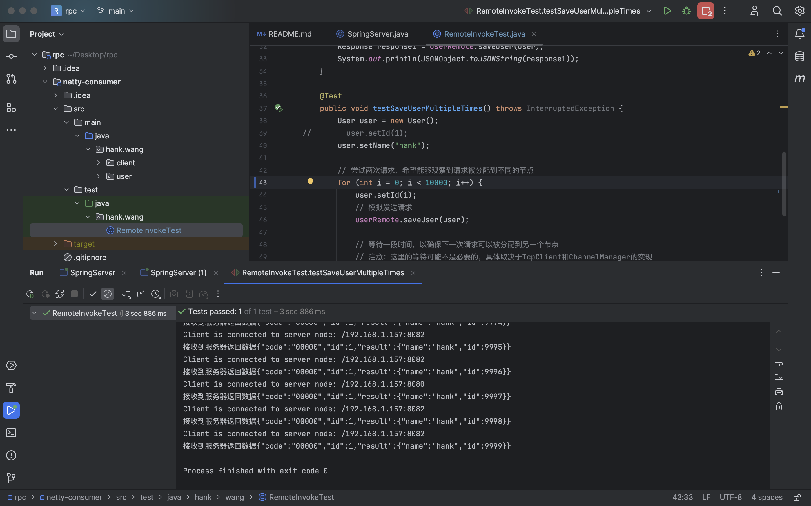

# Introduction 
本人学习Netty后决定自己写1个基于Netty、Zookeeper、Spring的轻量级RPC框架，收获颇丰，不过本人才疏学浅，难免有所疏漏，若有批评和建议请发到邮箱allenwzh@outlook.com

# Features
- **支持长连接**
- **支持异步调用**
- **支持心跳检测**
- **支持JSON序列化**
- **接近零配置，基于注解实现调用**
- **基于Zookeeper实现服务注册中心**
- **支持客户端连接动态管理**
- **支持客户端服务监听、发现功能**
- **支持服务端服务注册功能**
- **基于Netty4.X版本实现**

# Quick Start
- 该项目使用两个netty-rpc项目文件来模拟两台服务器的，通过SpringServer开启服务器
- 服务器开启后，自动注册到zookeeper的netty节点下，不同服务器通过端口号和序列号做区分
- 客户端开启后，自动去zookeeper轮询可适用的服务器节点

### 使用
- **在你要调用的地方生成接口形式的属性，为该属性添加@RemoteInvoke注解**
	<pre>
  	@RunWith(SpringJUnit4ClassRunner.class)
		@ContextConfiguration(classes = RemoteInvokeTest.class)
		@ComponentScan("hank.wang")
  
		public class RemoteInvokeTest {
    	
  		@RemoteInvoke
			private UserRemote userRemote;
	
			@Test
			public void testSaveUserMultipleTimes() throws InterruptedException {
				User user = new User();
				user.setName("hank");
		
				// 模拟10000次客户端请求
				for (int i = 0; i < 10000; i++) {
					user.setId(i);
					// 模拟发送请求
					userRemote.saveUser(user);
				}
			}
		}
	</pre>

### 结果
- **一万次调用结果**

# Overview

